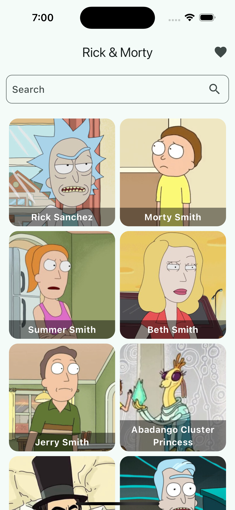
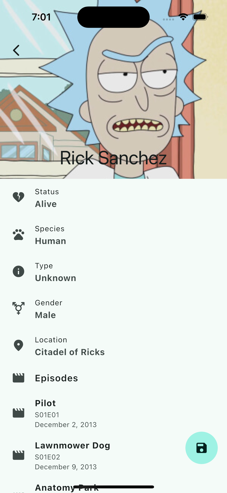
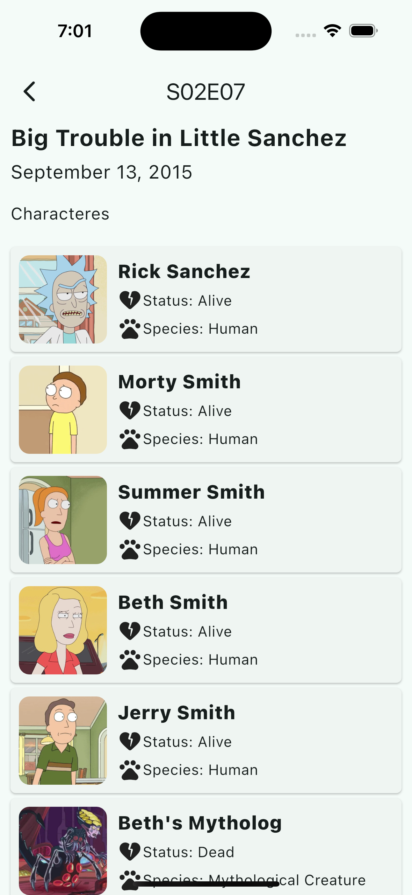

# Rick & Morty - Flutter

This is a Flutter application about Rick and Morty characters built in order to practice the basics of Flutter and Dart. It used the public [Rick and Morty API](https://rickandmortyapi.com/).

## Project Images
<div style="display: inline-block;">
s


</div>

## Implemented features - main features to be implemented

* [x] View all characters from the Rick and Morty series, with the possibility of filtering by name and displaying their characteristics (name, status, species, gender, location, episode)
* [x] View details of a character in the series, with the list of episodes in which they appear.
* [x] When viewing the details of a character and viewing the list of episodes, viewing the details of the episode and being shown the list of characters in that episode
* [x] Save your favorite characters in a separate list so that you can consult them whenever you want. Thus having a CRUD of these characters.
  
## features to be implemented

* [ ] Test the application functions
* [ ] Abstract the HTTP client library
* [ ] Adjustment on character details screen, page view between details and episode list
* [ ] Added filtering to the main screen character list

## How to run the application

### 1. Install Flutter

If you don't already have Flutter installed, follow the instructions on [the official Flutter website](https://flutter.dev/) to set up your environment.

To check if everything is correctly configured, run the following command in the terminal:

```bash
flutter doctor
````

### 2. Clone the GitHub repository

Open the terminal and navigate to the directory where you want to store the project. Then clone the repository using the command:

```bash
git clone git@github.com:AntonioAndradeGomes/rmapp.git
`````

### 3. Navigate to the project directory

After cloning the repository, enter the project directory

### 4. Install project dependencies

Flutter uses the pubspec.yaml file to manage dependencies. To install all required dependencies, run:

```bash
flutter pub get
````

### 5. Run the project on the emulator or device

- Android/iOS Emulator: To open the emulator, you can use Android Studio or Visual Studio Code (if you are using a configured emulator).

- Physical Device: Make sure the device is connected via USB and that developer mode is enabled.

Run the following command to start the application:

```bash
flutter run
````
